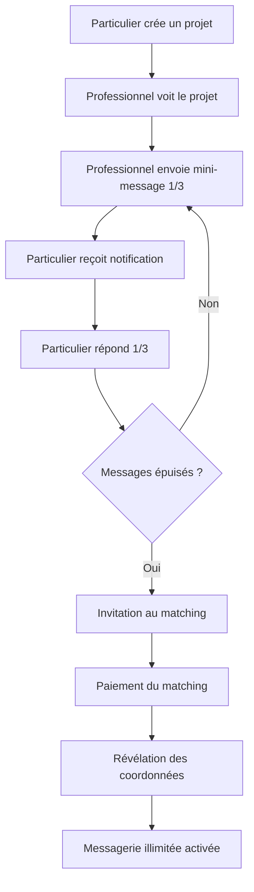

# 📨 Guide des Mini-Messages Pré-Match

## 🎯 Vue d'ensemble

Le système de **mini-messages** permet aux particuliers et professionnels d'amorcer un contact **avant le matching payant**, tout en garantissant la sécurité et en évitant le contournement de la plateforme.

---

## ✅ Fonctionnalités Implémentées

### 1. **Limitations Strictes**
- ✅ **3 messages maximum** par utilisateur (particulier ET professionnel)
- ✅ **100 caractères maximum** par message
- ✅ **Détection automatique** des numéros de téléphone
- ✅ **Blocage des coordonnées** (email, téléphone, messageries externes)

### 2. **Sécurité Renforcée**
- ✅ Validation **côté serveur** (PostgreSQL triggers)
- ✅ Validation **côté client** (TypeScript)
- ✅ **RLS (Row Level Security)** activé
- ✅ Modération automatique avec statuts: `pending`, `approved`, `flagged`, `blocked`

### 3. **Expérience Utilisateur**
- ✅ Compteur de messages restants en temps réel
- ✅ Messages d'erreur clairs et pédagogiques
- ✅ Notifications pour nouveaux messages
- ✅ Révélation automatique après matching

---

## 📊 Architecture Technique

### Base de Données

```sql
-- Table mini_messages
CREATE TABLE mini_messages (
  id UUID PRIMARY KEY,
  project_id UUID REFERENCES projects(id),
  professional_id UUID REFERENCES professionals(id),
  sender_id UUID REFERENCES profiles(id),
  content TEXT CHECK (char_length(content) <= 100),
  sender_type TEXT CHECK (sender_type IN ('client', 'professional')),
  message_number INTEGER CHECK (message_number BETWEEN 1 AND 3),
  contains_digits BOOLEAN DEFAULT FALSE,
  moderation_status TEXT DEFAULT 'pending',
  blocked_reason TEXT,
  is_pre_match BOOLEAN DEFAULT TRUE,
  revealed_at TIMESTAMP WITH TIME ZONE,
  created_at TIMESTAMP WITH TIME ZONE DEFAULT NOW(),
  updated_at TIMESTAMP WITH TIME ZONE DEFAULT NOW(),
  UNIQUE(project_id, professional_id, sender_type, message_number)
);
```

### Fonctions SQL

#### 1. **Validation Automatique**
```sql
CREATE FUNCTION validate_mini_message() RETURNS TRIGGER
```
- Vérifie la longueur (≤ 100 caractères)
- Compte les messages existants (≤ 3)
- Détecte les numéros de téléphone
- Bloque les coordonnées suspectes

#### 2. **Révélation des Messages**
```sql
CREATE FUNCTION reveal_mini_messages(p_project_id UUID, p_professional_id UUID)
```
- Appelée automatiquement après un matching réussi
- Passe `is_pre_match` à `FALSE`
- Enregistre `revealed_at`

#### 3. **Messages Restants**
```sql
CREATE FUNCTION get_remaining_mini_messages(
  p_project_id UUID,
  p_professional_id UUID,
  p_sender_type TEXT
) RETURNS INTEGER
```
- Retourne le nombre de messages restants (0-3)

---

## 🔒 Règles de Sécurité

### Patterns Bloqués

#### ❌ Numéros de Téléphone
```regex
0[1-9][\s\.\-]?\d{2}[\s\.\-]?\d{2}[\s\.\-]?\d{2}[\s\.\-]?\d{2}  # FR
\+33[\s\.\-]?[1-9][\s\.\-]?\d{2}[\s\.\-]?\d{2}[\s\.\-]?\d{2}[\s\.\-]?\d{2}  # International
\d{10,}  # Suite de 10+ chiffres
```

#### ❌ Emails
```regex
@  # Tout caractère @
```

#### ❌ Messageries Externes
```regex
whatsapp|telegram|signal|viber|messenger
```

### Exemples de Messages Bloqués

| Message | Raison |
|---------|--------|
| "Appelez-moi au 06 12 34 56 78" | ❌ Numéro de téléphone |
| "Contactez-moi: jean@email.fr" | ❌ Adresse email |
| "Écrivez-moi sur WhatsApp" | ❌ Messagerie externe |
| "Mon numéro: 0612345678" | ❌ Numéro sans espaces |

### Exemples de Messages Valides

| Message | Statut |
|---------|--------|
| "Bonjour, je suis intéressé par votre projet de rénovation" | ✅ Approuvé |
| "Disponible pour un devis gratuit" | ✅ Approuvé |
| "Expérience de 15 ans dans le domaine" | ⚠️ Flagué (contient "15") |
| "Pouvez-vous préciser la surface ?" | ✅ Approuvé |

---

## 💻 Utilisation du Service

### TypeScript Service

```typescript
import { miniMessagesService } from '@/services/miniMessagesService';

// Envoyer un message
const result = await miniMessagesService.sendMiniMessage({
  projectId: 'uuid-project',
  professionalId: 'uuid-pro',
  content: 'Bonjour, je suis intéressé',
  senderType: 'client'
});

if (result.success) {
  console.log('Message envoyé:', result.message);
} else {
  console.error('Erreur:', result.error);
}

// Récupérer les messages
const messages = await miniMessagesService.getMiniMessages(
  projectId,
  professionalId
);

// Obtenir les statistiques
const stats = await miniMessagesService.getMessageStats(
  projectId,
  professionalId,
  'client'
);

console.log(`Messages restants: ${stats.remainingMessages}/3`);
```

### API Endpoints

#### POST `/api/mini-messages/send`
```json
{
  "projectId": "uuid",
  "professionalId": "uuid",
  "content": "Votre message ici",
  "senderType": "client"
}
```

**Réponse succès:**
```json
{
  "success": true,
  "message": {
    "id": "uuid",
    "content": "Votre message ici",
    "message_number": 1,
    "moderation_status": "approved",
    "created_at": "2026-06-16T00:00:00Z"
  }
}
```

**Réponse erreur:**
```json
{
  "error": "Message bloqué: Les échanges de coordonnées sont interdits",
  "blocked": true
}
```

---

## 👥 Guide Utilisateur

### Pour les Particuliers

#### ✅ Bonnes Pratiques
1. **Soyez concis** (100 caractères max)
2. **Posez des questions pertinentes** sur le projet
3. **Évitez les coordonnées** - utilisez la plateforme
4. **Procédez au matching** pour débloquer la messagerie complète

#### 💡 Exemples de Messages Efficaces
- "Quelle est votre disponibilité pour ce projet ?"
- "Avez-vous des références similaires ?"
- "Quel est votre délai d'intervention ?"
- "Pouvez-vous vous déplacer dans ma zone ?"

#### ⚠️ À Éviter
- ❌ Donner votre numéro de téléphone
- ❌ Partager votre email
- ❌ Proposer de continuer sur WhatsApp
- ❌ Écrire des messages trop longs

### Pour les Professionnels

#### ✅ Bonnes Pratiques
1. **Répondez rapidement** aux mini-messages
2. **Montrez votre expertise** en quelques mots
3. **Encouragez le matching** pour approfondir
4. **Restez professionnel** et courtois

#### 💡 Exemples de Réponses Efficaces
- "Disponible sous 48h pour un devis gratuit"
- "Spécialisé dans ce type de travaux depuis 10 ans"
- "Je peux me déplacer dans votre secteur"
- "Matchons pour discuter des détails !"

#### ⚠️ À Éviter
- ❌ Demander le numéro du client
- ❌ Proposer un rendez-vous hors plateforme
- ❌ Partager vos coordonnées
- ❌ Faire des promesses sans devis

---

## 🔄 Workflow Complet



---

## 📈 Statistiques et Modération

### Vue Admin

```sql
SELECT * FROM mini_messages_moderation_stats;
```

| moderation_status | total_messages | unique_projects | messages_with_digits |
|-------------------|----------------|-----------------|----------------------|
| approved          | 1250           | 420             | 0                    |
| flagged           | 45             | 32              | 45                   |
| blocked           | 12             | 10              | 12                   |

### Indicateurs Clés
- **Taux de blocage**: < 1% (objectif)
- **Taux de conversion** (mini-message → matching): 35-45%
- **Temps de réponse moyen**: < 2h

---

## 🛠️ Configuration

### Paramètres Plateforme

```sql
SELECT * FROM platform_settings WHERE category = 'messaging';
```

| setting_key | setting_value | description |
|-------------|---------------|-------------|
| mini_messages_max_count | 3 | Nombre max de messages |
| mini_messages_max_length | 100 | Longueur max en caractères |
| mini_messages_moderation_enabled | true | Modération automatique |
| mini_messages_block_digits | true | Bloquer les numéros |

---

## 🚀 Déploiement

### 1. Appliquer la Migration

```bash
# Exécuter la migration SQL
psql -h your-db-host -U postgres -d your-database -f supabase/migrations/20260617000000_create_mini_messages.sql
```

### 2. Vérifier la Table

```sql
\d mini_messages
SELECT * FROM mini_messages LIMIT 5;
```

### 3. Tester les Fonctions

```sql
-- Test de validation
SELECT get_remaining_mini_messages(
  'project-uuid',
  'professional-uuid',
  'client'
);

-- Test de révélation
SELECT reveal_mini_messages(
  'project-uuid',
  'professional-uuid'
);
```

---

## 🐛 Dépannage

### Problème: Message bloqué à tort

**Solution:**
```sql
-- Vérifier le statut
SELECT * FROM mini_messages WHERE id = 'message-uuid';

-- Débloquer manuellement (admin uniquement)
UPDATE mini_messages
SET moderation_status = 'approved',
    blocked_reason = NULL
WHERE id = 'message-uuid';
```

### Problème: Limite non respectée

**Solution:**
```sql
-- Vérifier le compteur
SELECT COUNT(*) FROM mini_messages
WHERE project_id = 'uuid'
  AND professional_id = 'uuid'
  AND sender_type = 'client'
  AND is_pre_match = TRUE;

-- Réinitialiser si nécessaire (admin uniquement)
DELETE FROM mini_messages
WHERE project_id = 'uuid'
  AND professional_id = 'uuid';
```

---

## 📞 Support

Pour toute question ou problème:
- 📧 Email: support@swipetonpro.fr
- 💬 Chat: Disponible dans votre dashboard
- 📚 Documentation: https://docs.swipetonpro.fr

---

## 🔐 Sécurité et Confidentialité

### Engagement de la Plateforme

✅ **Vos données sont protégées**
- Chiffrement end-to-end
- Conformité RGPD
- Pas de revente de données

✅ **Votre sécurité est prioritaire**
- Modération automatique 24/7
- Signalement facile des abus
- Équipe de modération humaine

✅ **Transparence totale**
- Vous savez toujours qui vous contacte
- Historique complet des échanges
- Contrôle total sur vos données

---

## 📝 Changelog

### Version 1.0.0 (16/06/2026)
- ✅ Création de la table `mini_messages`
- ✅ Validation stricte (3 messages, 100 caractères)
- ✅ Détection automatique des coordonnées
- ✅ Service TypeScript complet
- ✅ API endpoints sécurisés
- ✅ RLS et politiques de sécurité
- ✅ Notifications en temps réel

---

**🎉 Le système de mini-messages est maintenant opérationnel !**

Pour toute amélioration ou suggestion, n'hésitez pas à contribuer ou à contacter l'équipe technique.
