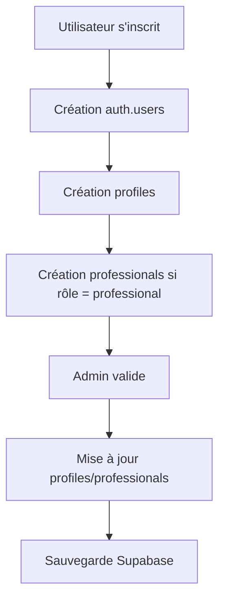

# 🔄 WORKFLOW CRÉATION PROFILS - Application vs Admin

---

## 🎯 **PRINCIPE FONDAMENTAL**

### **📋 Flux normal**
1. **Inscription** : Utilisateur s'inscrit dans l'application
2. **Création automatique** : Profil créé dans Supabase
3. **Validation admin** : Admin valide/modifie si nécessaire
4. **Synchronisation** : Données sauvegardées dans Supabase

---

## ❌ **PROBLÈME ACTUEL**

### **🔍 Ce qui se passe**
1. **Validation admin** : ✅ Vous validez le professionnel
2. **Synchronisation** : ❌ Pas d'enregistrement dans Supabase
3. **Résultat** : Profil professionnel manquant

### **🔍 Cause probable**
- **Formulaire admin** : Validation sans création de profil
- **Workflow incomplet** : Étape de sauvegarde manquante
- **Frontend only** : Validation UI mais pas backend

---

## ✅ **SOLUTION CORRECTE**

### **📋 Workflow idéal**


### **🔧 Points de contrôle**
1. **Inscription** : `src/pages/auth/create-account.tsx`
2. **Admin users** : `src/pages/admin/users.tsx`
3. **Admin projects** : `src/pages/admin/create-project.tsx`

---

## 🛠️ **DIAGNOSTIC DU CODE**

### **📋 Vérifier le workflow d'inscription**
```typescript
// Dans create-account.tsx
const handleCreateAccount = async () => {
  // 1. Création utilisateur Supabase Auth
  const { data: authData, error: authError } = await supabase.auth.signUp({
    email,
    password,
  });
  
  // 2. Création profil dans profiles table
  const { data: profileData, error: profileError } = await supabase
    .from('profiles')
    .insert([{ id: authData.user.id, email, role: 'professional' }]);
    
  // 3. Création fiche professionnelle si nécessaire
  if (role === 'professional') {
    await supabase
      .from('professionals')
      .insert([{ user_id: authData.user.id, company_name, siret }]);
  }
};
```

### **📋 Vérifier le workflow admin**
```typescript
// Dans admin/users.tsx
const handleValidateProfessional = async (userId) => {
  // 1. Mettre à jour le rôle dans profiles
  await supabase
    .from('profiles')
    .update({ role: 'professional' })
    .eq('id', userId);
    
  // 2. Créer la fiche professionnelle
  await supabase
    .from('professionals')
    .insert([{ user_id: userId, company_name, siret }]);
};
```

---

## 🎯 **ACTIONS CORRECTIVES**

### **📋 1. Vérifier l'inscription professionnelle**
1. **Tester** l'inscription d'un nouveau professionnel
2. **Vérifier** que le profil est créé dans Supabase
3. **Confirmer** que la fiche professionnelle est créée

### **📋 2. Corriger le workflow admin**
1. **Analyser** le code de validation admin
2. **Ajouter** l'étape de création de profil si manquante
3. **Tester** la validation d'un professionnel existant

### **📋 3. Solution temporaire**
```sql
-- Créer manuellement le profil pour sotbirida@gmail.com
-- Utiliser creer-profil-manquant-sotbirida.sql
```

---

## 🎉 **CONCLUSION**

**🔧 Le problème : Les profils doivent être créés dans l'application ET sauvegardés dans Supabase !**

**🎯 Workflow correct :**
1. **Inscription** : Crée automatiquement profil + fiche professionnelle
2. **Admin** : Valide et met à jour dans Supabase
3. **Synchronisation** : Données persistantes dans la base

**📋 Actions immédiates :**
1. **Exécuter** `creer-profil-manquant-sotbirida.sql` (solution temporaire)
2. **Vérifier** le code d'inscription professionnelle
3. **Corriger** le workflow admin si nécessaire
4. **Tester** le flux complet

**✨ Une fois le workflow corrigé, tous les futurs profils seront créés automatiquement !**
